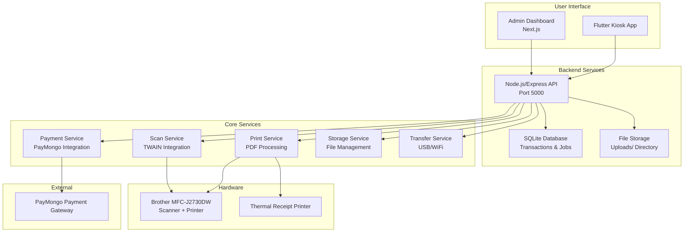
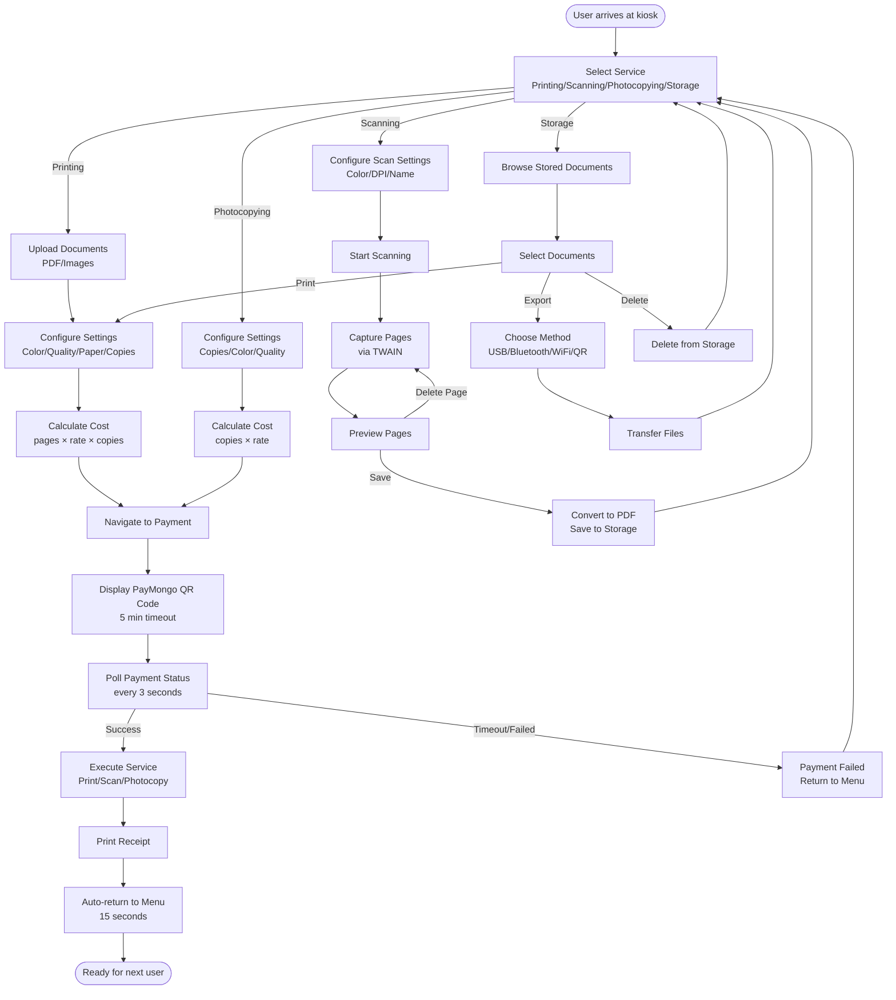

# DocuCenter Kiosk Architecture

## Overall Block Diagram

## User Workflow Flowchart

## Component Details

### Frontend (Flutter)
- **Main App**: Service selection tabs (Printing, Scanning, Photocopying, Storage)
- **Pages**: Dedicated UI for each service with configuration options
- **Services**: API clients for backend communication

### Backend (Node.js)
- **API Routes**: RESTful endpoints for all operations
- **Services**: Business logic for payments, printing, scanning, storage
- **Database**: SQLite for transaction and job tracking
- **Storage**: Local file system for document persistence

### Admin (Next.js)
- **Dashboard**: Real-time monitoring of transactions and jobs
- **Storage Browser**: File management interface
- **Transaction History**: Payment tracking and analytics

### Hardware Integration
- **Scanner**: TWAIN protocol via Dynamsoft Web TWAIN
- **Printer**: Native OS printing with PDF processing
- **Transfer**: Multiple export methods for user convenience

### Payment Processing
- **PayMongo**: QR code generation and status polling
- **Timeout**: 5-minute window for payment completion
- **Verification**: Automatic polling and webhook support</content>
<parameter name="filePath">ARCHITECTURE.md