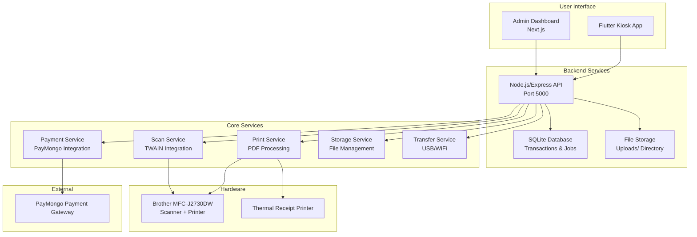
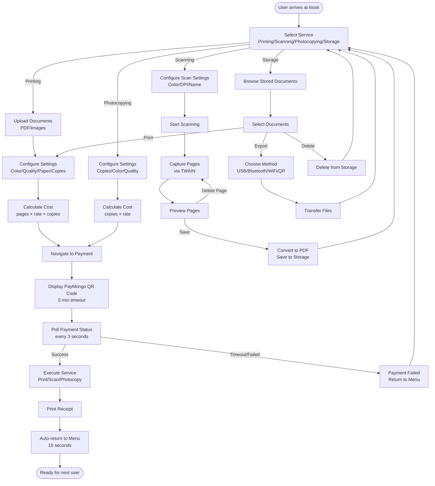
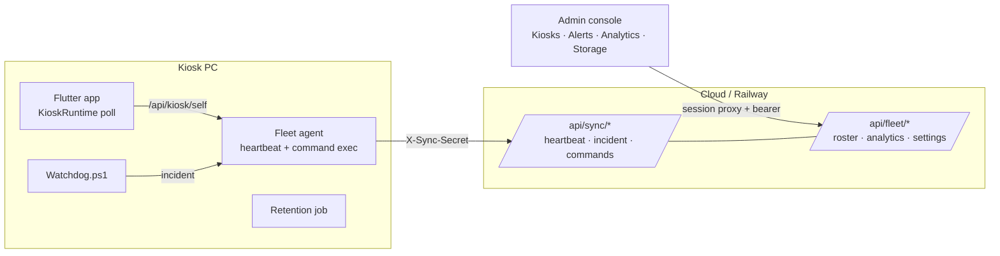

# DocuCenter Kiosk Architecture

## Overall Block Diagram

```mermaid
graph TB
    subgraph "User Interface"
        A[Flutter Kiosk App]
        B[Admin Dashboard<br/>Next.js]
    end

    subgraph "Backend Services"
        C[Node.js/Express API<br/>Port 5000]
        D[SQLite Database<br/>Transactions & Jobs]
        E[File Storage<br/>Uploads/ Directory]
    end

    subgraph "Core Services"
        F[Payment Service<br/>PayMongo Integration]
        G[Print Service<br/>PDF Processing]
        H[Scan Service<br/>TWAIN Integration]
        I[Storage Service<br/>File Management]
        J[Transfer Service<br/>USB/WiFi]
    end

    subgraph "Hardware"
        K[Brother MFC-J2730DW<br/>Scanner + Printer]
        L[Thermal Receipt Printer]
    end

    subgraph "External"
        M[PayMongo Payment Gateway]
    end

    A --> C
    B --> C
    C --> D
    C --> E
    C --> F
    C --> G
    C --> H
    C --> I
    C --> J
    F --> M
    G --> K
    H --> K
    G --> L
```

## User Workflow Flowchart

```mermaid
flowchart TD
    Start([User arrives at kiosk]) --> Menu[Select Service<br/>Printing/Scanning/Photocopying/Storage]

    Menu -->|Printing| Upload[Upload Documents<br/>PDF/Images]
    Upload --> Config[Configure Settings<br/>Color/Quality/Paper/Copies]
    Config --> Calc[Calculate Cost<br/>pages × rate × copies]
    Calc --> Pay[Navigate to Payment]

    Menu -->|Scanning| ScanSettings[Configure Scan Settings<br/>Color/DPI/Name]
    ScanSettings --> StartScan[Start Scanning]
    StartScan --> Capture[Capture Pages<br/>via TWAIN]
    Capture --> Preview[Preview Pages]
    Preview -->|Save| SavePDF[Convert to PDF<br/>Save to Storage]
    Preview -->|Delete Page| Capture
    SavePDF --> Menu

    Menu -->|Photocopying| PhotoSettings[Configure Settings<br/>Copies/Color/Quality]
    PhotoSettings --> PhotoCalc[Calculate Cost<br/>copies × rate]
    PhotoCalc --> Pay

    Menu -->|Storage| Browse[Browse Stored Documents]
    Browse --> Select[Select Documents]
    Select -->|Print| Config
    Select -->|Export| Export[Choose Method<br/>USB/Bluetooth/WiFi/QR]
    Export --> Transfer[Transfer Files]
    Transfer --> Menu
    Select -->|Delete| Delete[Delete from Storage]
    Delete --> Menu

    Pay --> QR[Display PayMongo QR Code<br/>5 min timeout]
    QR --> Poll[Poll Payment Status<br/>every 3 seconds]
    Poll -->|Success| Execute[Execute Service<br/>Print/Scan/Photocopy]
    Poll -->|Timeout/Failed| Fail[Payment Failed<br/>Return to Menu]
    Execute --> Receipt[Print Receipt]
    Receipt --> AutoReturn[Auto-return to Menu<br/>15 seconds]
    AutoReturn --> End([Ready for next user])

    Fail --> Menu
```

## Component Details

### Frontend (Flutter)
- **Main App**: Service selection tabs (Printing, Scanning, Photocopying, Storage)
- **Pages**: Dedicated UI for each service with configuration options
- **Services**: API clients for backend communication

### Backend (Node.js)
- **API Routes**: RESTful endpoints for all operations
- **Services**: Business logic for payments, printing, scanning, storage
- **Database**: SQLite for transaction and job tracking
- **Storage**: Local file system for document persistence

### Admin (Next.js)
- **Dashboard**: Real-time monitoring of transactions and jobs
- **Storage Browser**: File management interface
- **Transaction History**: Payment tracking and analytics

### Hardware Integration
- **Scanner**: TWAIN protocol via Dynamsoft Web TWAIN
- **Printer**: Native OS printing with PDF processing
- **Transfer**: Multiple export methods for user convenience

### Payment Processing
- **PayMongo**: QR code generation and status polling
- **Timeout**: 5-minute window for payment completion
- **Verification**: Automatic polling and webhook support

## Monitoring & Control Plane

Layered on top of the metadata sync. Full detail in [docs/MONITORING.md](docs/MONITORING.md).

```mermaid
graph LR
    subgraph Kiosk PC
        FA[Fleet agent<br/>heartbeat + command exec]
        RJ[Retention job]
        APP[Flutter app<br/>KioskRuntime poll]
        WD[Watchdog.ps1]
    end
    subgraph Cloud / Railway
        SYNC[/api/sync/*<br/>heartbeat · incident · commands/]
        FLEET[/api/fleet/*<br/>roster · analytics · settings/]
    end
    ADMIN[Admin console<br/>Kiosks · Alerts · Analytics · Storage]

    FA -- "X-Sync-Secret" --> SYNC
    APP -- "/api/kiosk/self" --> FA
    WD -- "incident" --> FA
    ADMIN -- "session proxy + bearer" --> FLEET
    SYNC --- FLEET
```

- **Heartbeat** → `kiosks.last_seen`; OFFLINE after 60 s. No retry queue.
- **Commands** (`kiosk_commands`) ride the heartbeat response: maintenance mode,
  disable printing (enforced server-side, 423), restart spooler, restart app.
- **Incidents** (`incidents`) — structured `device/error_code/severity` events,
  forwarded via the durable outbox, shown on the Alerts page with a nav badge.
- **Analytics** — revenue / usage / peak-demand rollups from `transactions` and
  the widened `print_jobs`.
- **Retention** — `storage_settings` singleton, purge job on the kiosk role,
  `delete_after_print` hook in the print route.
- **Roles** — `INSTANCE_ROLE=kiosk|cloud|both` gates which timers run where.</content>
<parameter name="filePath">ARCHITECTURE.md